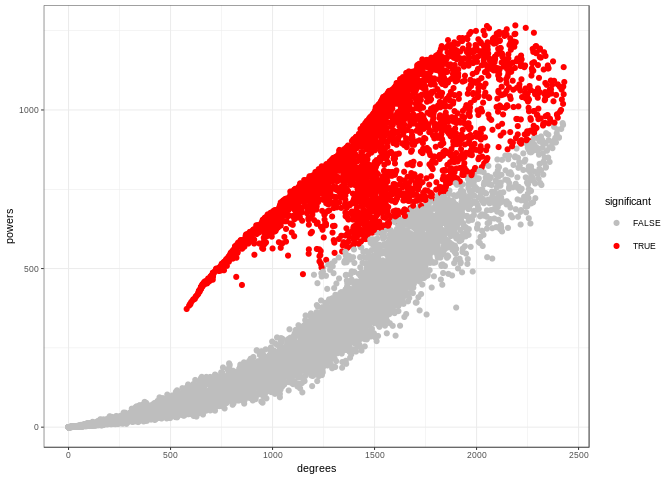
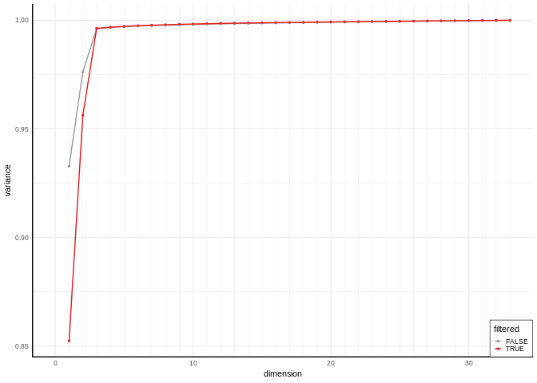
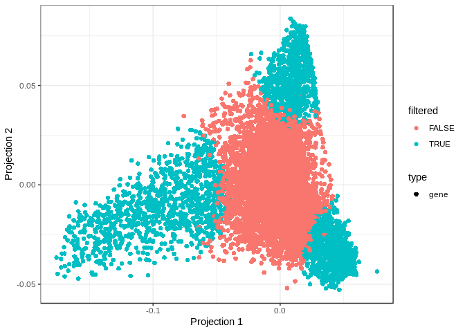
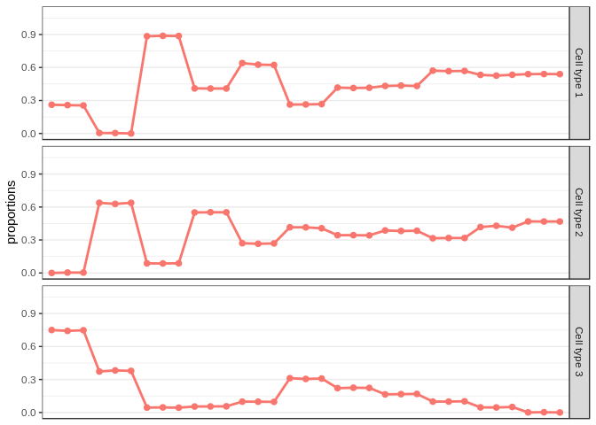
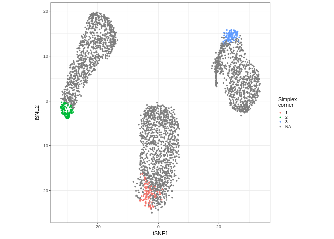
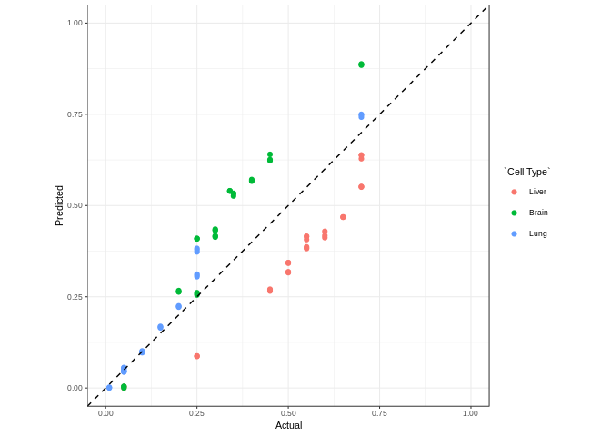

Linseed tutorial
================

Linseed (LINear Subspace identification for gene Expresion Deconvolution) is a package that provides tools and interface to explore gene expression datasets in linear space.

Installing the package
----------------------

You can install the package using `devtools::install_github`:

``` r
devtools::install_github("ctlab/linseed")
```

Current build was tested using rhub:

Getting started with linseed
----------------------------

To start working with gene expression data, we need to create a new LinseedObject, in this tutorial we will use GSE19830 (mixture of Liver, Brain and Lung), we will take only mixed samples (10-42) and will take only 10000 most expressed genes.

``` r
library(linseed)
lo <- LinseedObject$new("GSE19830", samples=10:42, topGenes=10000)
```

Coolinearity networks
---------------------

To build a coolinearity network we first have to evaluate all pairwise collinearity coefficients, all pairwise spearman correlation and then run significance test which will calculate p value for each each by shuffling network weights randomly.

``` r
lo$calculatePairwiseLinearity()
lo$calculateSpearmanCorrelation()
lo$calculateSignificanceLevel(100)
lo$significancePlot(0.01)
```



``` r
lo$filterDatasetByPval(0.01)
```

    ## Total number of genes is 10000

    ## The number of genes after filtering is 3297

``` r
lo$svdPlot()
```



To visualiaze what left after filtering we can call projection plot from our object. But we have to project the data to the simplex first.

``` r
lo$setCellTypeNumber(3)
lo$project("full") # projecting full dataset
lo$projectionPlot(color="filtered")
```



Deconvolution
-------------

To deconvolve the dataset, you first have to project (full or filtered dataset) to the simplex, and then find corners of it.

``` r
lo$project("filtered")
lo$smartSearchCorners(dataset="filtered", error="norm")
```

    ## Final vector is

    ## 4 1 5

    ## 

``` r
lo$deconvolveByEndpoints()
plotProportions(lo$proportions)
```



We can also use tSNE to haave an idea of how data looks like when dimensionally reduced.

``` r
# lets select 100 genes closest to the simplex corners 
lo$selectGenes(100)
lo$tsnePlot()
```



To compare with actual proportions you can use `dotPlotProportions` function

``` r
data("proportionsLiverBrainLung")
dotPlotPropotions(lo$proportions, proportionsLiverBrainLung[, 10:42], guess=TRUE)
```


